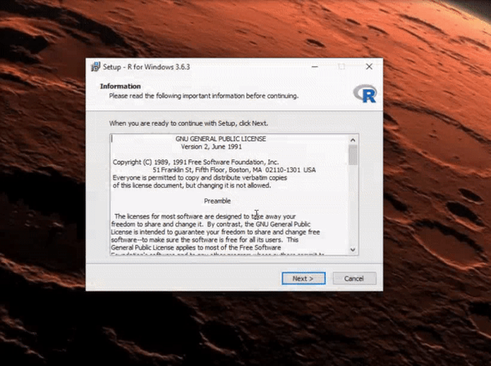
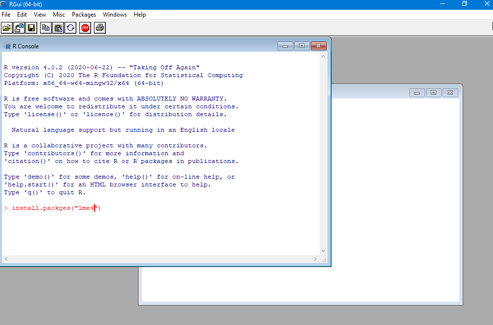
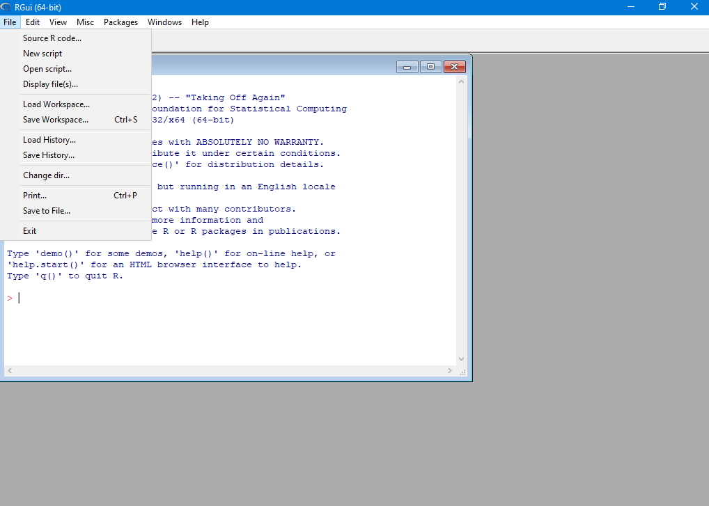
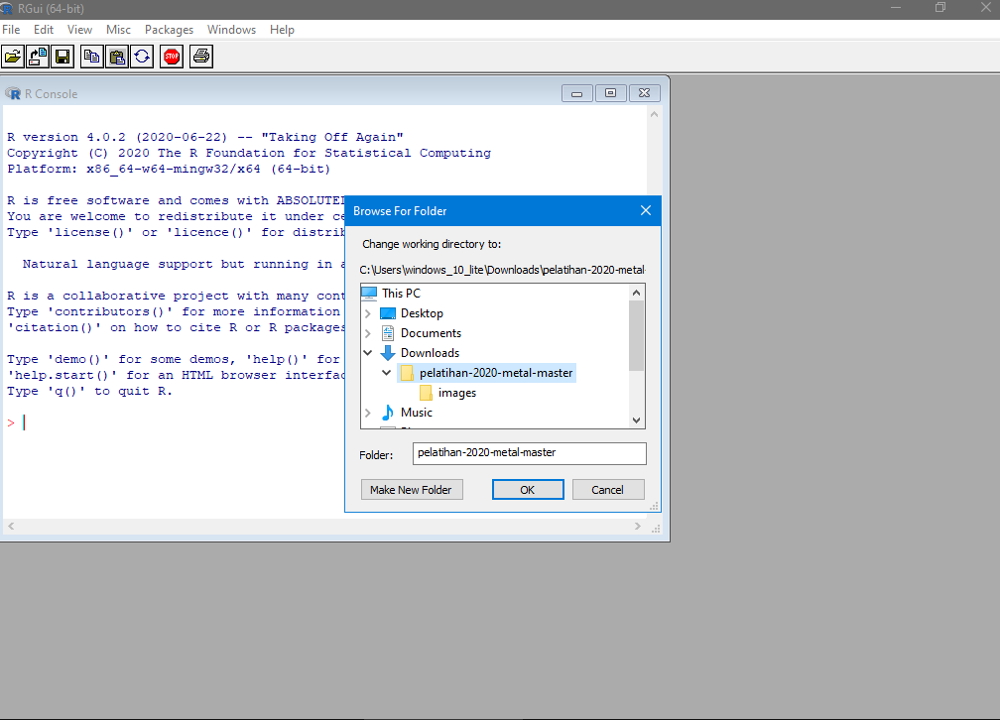
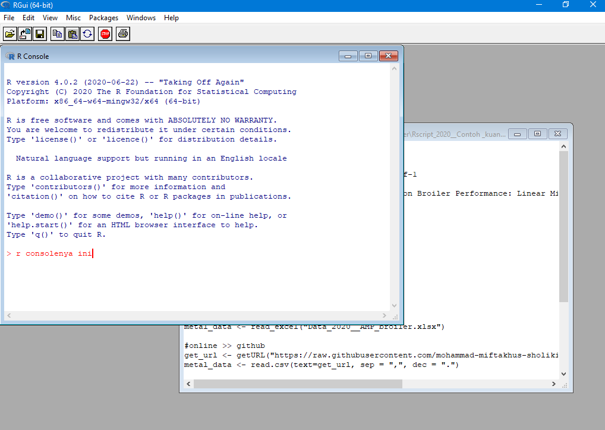
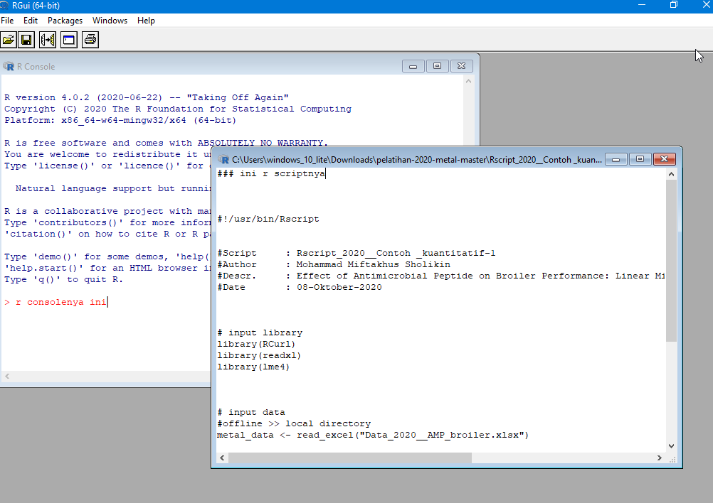

# Pelatihan Meta-Analisis Menggunakan R

# A. Instalasi R
1. Download di [**sini**](https://cran.r-project.org/bin/windows/base/R-4.0.2-win.exe) atau pergi kelaman [**ini**](https://cran.r-project.org/bin/windows/base/). (**NB: file rada gede gan 80an MB**)
2. Lakukan instalasi pada umumnya (pergi ke folder download -> klik dua kali file instaler -> ikuti petunjuk).

   

3. Kalau udah kelar coba cari di start menu ketikan **R** atau cari saja _scrolling_.

# B. Download file pelatiahannya
1. Klik di [sini](https://codeload.github.com/mohammad-miftakhus-sholikin/pelatihan-2020-metal/zip/master). Usahakan downloadnya di folder Downloads pada umumnya.
2. Kemudian ekstrak file "pelatihan-2020-metal.zip".

# C. Install packages yang dibutuhkan buat metal (Langkah ini bisa dilewati lanjut ke D.)
1. Lihat dulu tampilan program R nya.

   

   ini tanda klo R console siap diberikan perintah.
   ```r
   >
   ```

2. Di R console ketikan perintah berikut dan klik enter, "*bagian yang merah*".
   ```r
   install.packages("RCurl"); install.packages("lme4"); install.packages("readxl")
   ```
   biasanya pop up disuruh pilih server, langsung klik ok saja.
3. Kalo lancar pasti gak ada error. Coba cek scroll ke atas.
   
   ini contoh selesai install
   ```
   dst. dst.
   * DONE(RCurl)
   
   dst. dst.
   * DONE(lme4)

   dst. dst.
   * DONE(readxl)
   ```
   ini contoh klo eror 
   ```r
   Error in install.packages :
   ```

# D. Menjalankan R dan analisis
1. Pastikan R nya udah jalan, abis itu ganti diriektorinya dengan cara kilk File -> Change dir.... -> (cari lokasi tadi ekstrak filenya) -> klik ok

   

   
2. Untuk memastikan saja, ketikan perintah berikut di R console.
   
   ```r
   dir()
   ```
   outputnya nanti ini, klo gak ini coba cek direktory downloadnya tadi. Atau nanti tanya saya sambil di screen shot.
   ```r
   [1] "Data_2020__AMP_broiler.csv"           
   [2] "Data_2020__AMP_broiler.xlsx"          
   [3] "images"                               
   [4] "README.md"                            
   [5] "Rscript_2020__Contoh _kuantitatif-1.R"
   [6] "Rscript_2020__Contoh _kuantitatif-2.R"
   [7] "Rscript_2020__Contoh_kualitatif.R"
   ```
3. Abis tuh klik ikon open (di bawahnya menu File), selanjutnya cari nama **Rscript_2020__Contoh _kuantitatif-1.R**.
4. Klo udah blok tulisan yang ada dan klik Ctrl + R.

# F. Penjelasan R
1. Klo tampilannya yang penting tuh ada dua: satu, **R console** buat eksekusi kode jadi klo nulis perintah di sini terus klik enter otomatis nanti langsung dieksekusi (dijalankan perintahnya, ati-ati ya jan di close R consolenya nanti keluar dari program r). Yang kedua tuh, **R script** (ini semacam lembar kerja klo mau nulis kode atau perintah yang banyak, jadi gak repot2x harus ketikin perintah di console). Nah tadi tuh lupa jelasin klo di R console yang ada merah2xnya tuh perintah cuman bisa di ketik satu baris jadi susah klo mau ketik perintah banyak baris, makanya pake R script. Nah lanjut ke rscript ya, di sini tuh bisa nulis perintah berbaris2x jadi aman sebelum dijalankan ke R console. Nah gimana jalaninnya gampang blok kode yang ingin di jalankan lalu klik Ctrl + R, otomatis R consolenya jalan (liatin aja klo jalan biasanya klo ada eror nanti dikasih tau ama R consolenya dan apa aja erornya).
   
   ini R console

   
   
   ini R script
   
   
